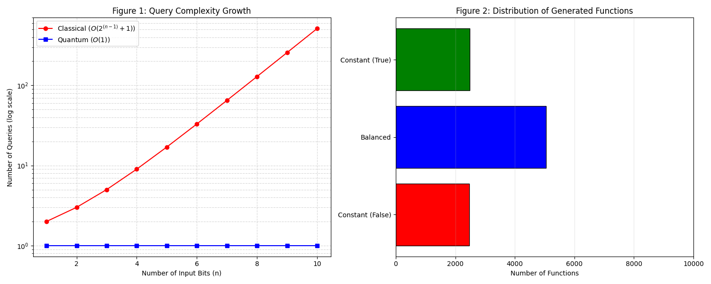
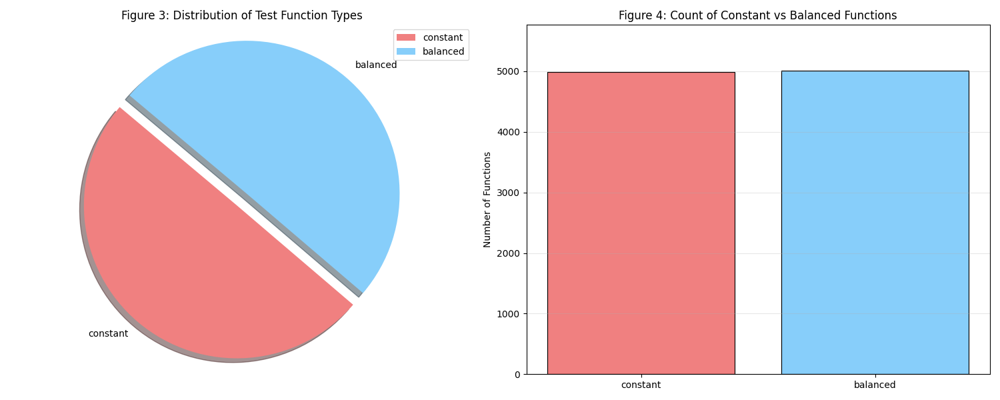
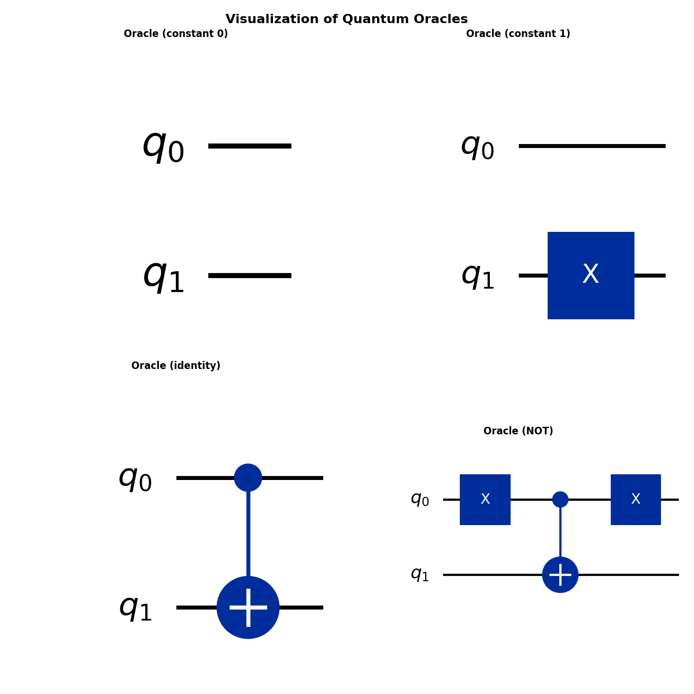
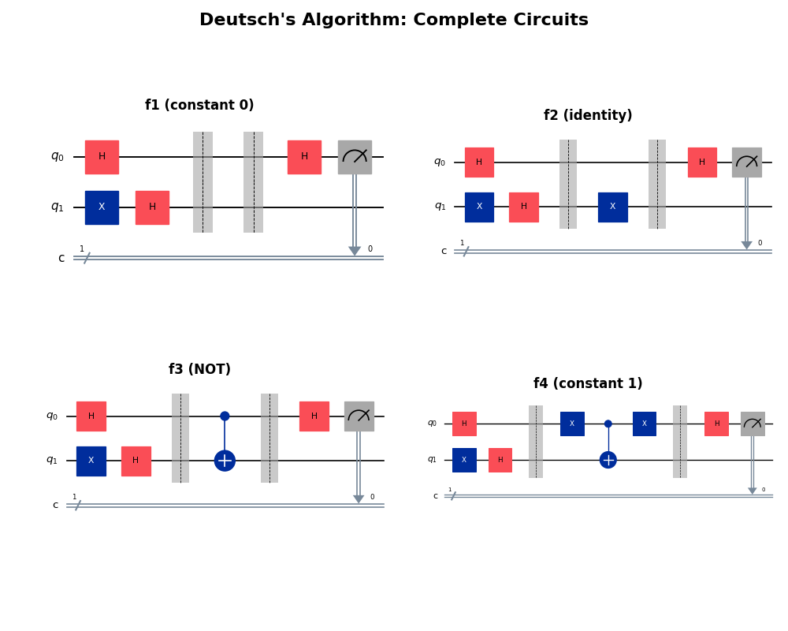
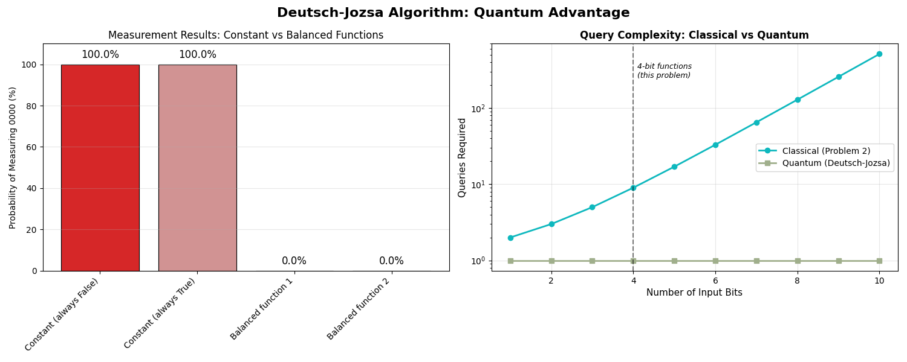

# Assessment Summer 25/26 (Year 4️⃣)
**Author:** Tomás Pettit

**Student ID:** G00419414

**Course:** Software Development

**Module:** Emerging Technology 💻

## Overview
This repository contains a complete Python implementation of the difference between classical and quantum algorithms. The assessment is divided into 5 problems covering generate random boolean, classical test, Quantum Oracles, Qiskit, and scaling algorithms.

## Requirements
- `Python 3.8^` (for modern type hints like list[int])

### Dependencies
Install required packages using:

```bash
pip install -r requirements.txt
```
Main dependencies: `numpy` for 32-bit unsigned integer operations and mathematical functions.

## How To Run

### Using Jupyter Notebook
1. Clone this repository: `git clone https://github.com/tomaspettit2506/ET-G00419414.git`
2. Install dependencies: `pip install -r requirements.txt`
3. Launch Jupyter: `jupyter notebook`
4. Open `problems.ipynb`
5. Run cells sequentially from top to bottom (without any errors)

**Note:** Cells must be run in order as later problems depend on functions from earlier problems.

## Project Structure
```text
.
├── problems.ipynb      # Main notebook with problem solutions
├── README.md          # This file
├── requirements.txt   # Python package dependencies
└── .gitignore        # Git ignore rules
```

## Problems Implemented

### Problem 1: Generating Random Boolean Functions
Implements a Python function generator that creates random Boolean functions guaranteed to be either constant (always return the same value) or balanced (return True for exactly half the inputs). These functions serve as test cases for the quantum algorithm.

### Problem 2: Classical Testing for Function Type
Develops a classical algorithm to determine whether a mystery Boolean function is constant or balanced by querying it with different inputs. Analyzes the query complexity (worst case: 9 queries for 4-bit functions) to establish a baseline for quantum comparison.

### Problem 3: Quantum Oracles
Creates quantum oracles one-by-one using Qiskit for the four single-bit Boolean functions used in Deutsch's algorithm and explain why it would work. Demonstrates how classical functions are encoded as quantum circuits using quantum gates (X and CNOT), introducing the fundamental concept of reversible quantum computation.

### Problem 4: Deutsch's Algorithm with Qiskit
Implements the complete Deutsch's quantum algorithm circuit that determines if a single-bit function is constant or balanced using only one query. Demonstrates quantum interference and superposition, achieving the result with half the queries required classically.

### Problem 5: Scaling to the Deutsch–Jozsa Algorithm
Generalizes Deutsch's algorithm to handle 4-bit Boolean functions from Problem 1. Demonstrates the full quantum advantage where one quantum query replaces up to 9 classical queries.

## Technologies Used
- Python
- Jupyter Notebook
- Qiskit (Quantum computing framework)
- NumPy
- Matplotlib

## Final Result Figures
### Problem 1: Generating Random Boolean Functions


> [Distribution Summary](data/distribution_summary.csv)

### Problem 2: Classical Output Distribution


> [Classification Summary](data/classification_summary.csv)

### Problem 3: Oracle Circuit Results


> [Oracle Complexity Analysis](data/oracle_complexity_analysis.csv)

### Problem 4: Deutsch Algorithm Results


> [Deutsch Algorithm Results](data/deutsch_algorithm_results.csv)

> [Deutsch Algorithm Probabilities](data/deutsch_algorithm_probabilities.csv)

### Problem 5: Deutsch-Jozsa Results


> [Deutsch Jozsa Test Results](data/deutsch_jozsa_test_results.csv)

## References
- [Deutsch-Jozsa Algorithms | IBM Quantum Platform](https://quantum.cloud.ibm.com/learning/en/modules/computer-science/deutsch-jozsa)
- [Qiskit Documentation](https://www.ibm.com/quantum/qiskit)
- [Qiskit Computating Fundamentals](https://quantum.cloud.ibm.com/learning/en)
- [Classical Information](https://quantum.cloud.ibm.com/learning/en/courses/basics-of-quantum-information/single-systems/classical-information)